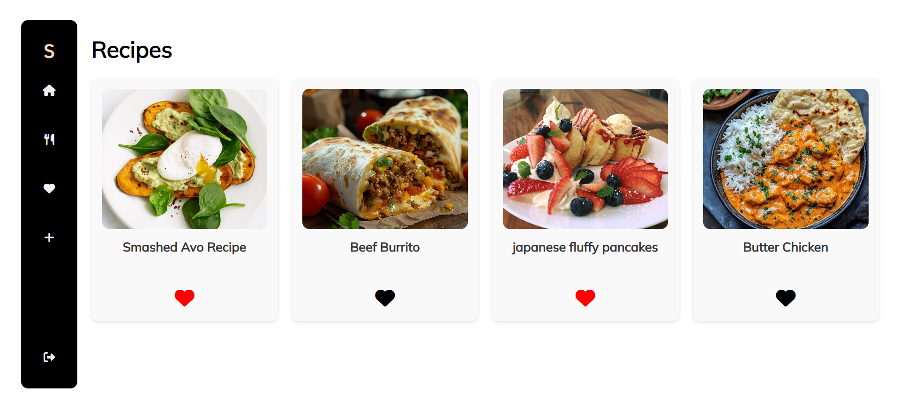

# 🍲 Recipe Hub

## 🕹️ Description

Recipe Hub is a simple, clean, and user-friendly web app for discovering, sharing, and managing delicious recipes.
Users can browse recipes, view detailed instructions and ingredients, add their favorite recipes, and leave comments.

## 🚀 Getting Started

👉 **Play it here:** [https://your-deployment-link.com](https://your-deployment-link.com)

👉 **Planning Materials:**
- [Trello Board](https://trello.com/b/2r9gcq7l/project-2)
- [Wireframe](https://www.figma.com/design/q91YBBq82stZrPNKba9Vl9/Recipes-Hub?node-id=5-0&t=ZMQ1ZPkZMWhwIfFy-0)

### How to Play
1. Open the app link.
2. Browse recipes.
3. Click a recipe to see full ingredients and instructions.
4. Add your own recipes or leave comments on existing ones.

## 💡 Technologies Used

- HTML
- CSS
- JavaScript (Node.js, Express, EJS)
- MongoDB

## 📚 Attributions

- Fonts: Google Fonts — Mulish, Inter, Baloo Bhai 2  
- Icons: [Font Awesome](https://fontawesome.com/)

## 🚧 Next Steps

- Add user profiles
- Implement recipe rating system
- Improve mobile responsiveness and UI animations
- Add video tutorials for recipes